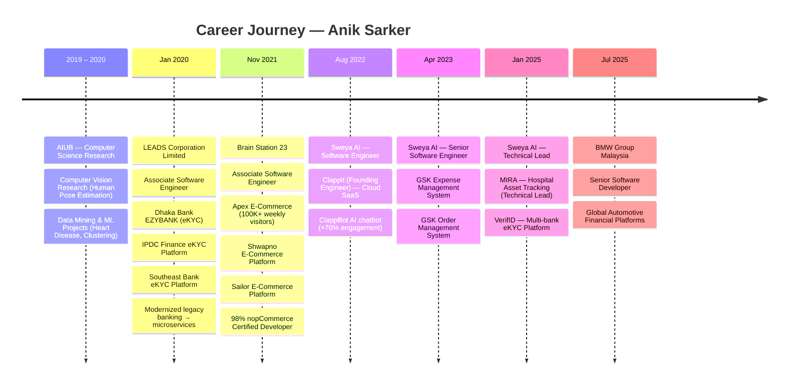
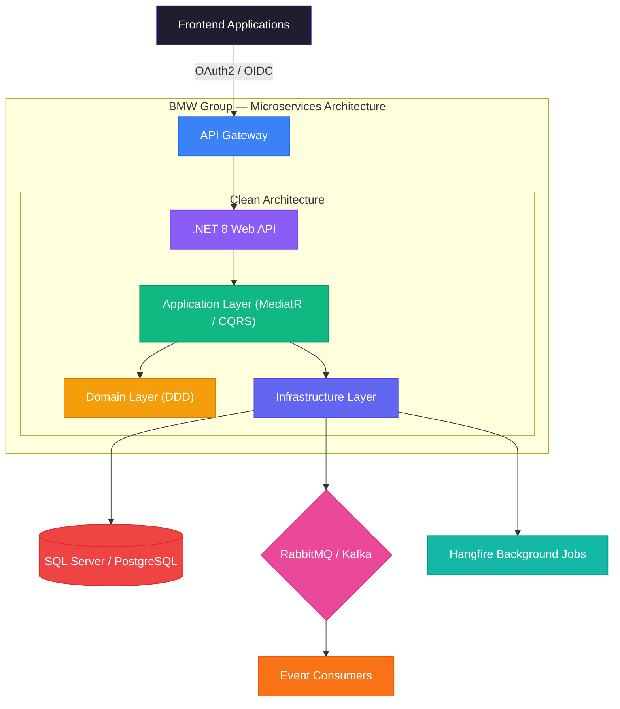
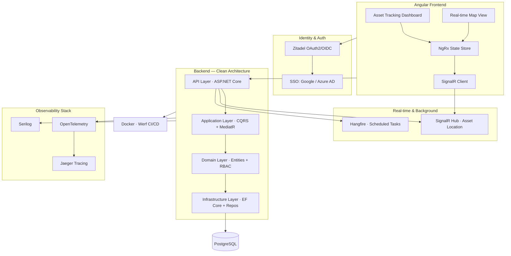
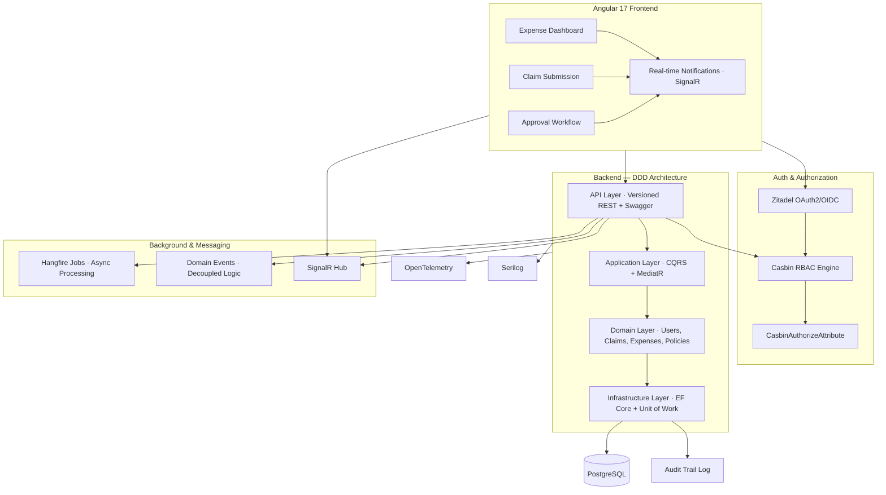
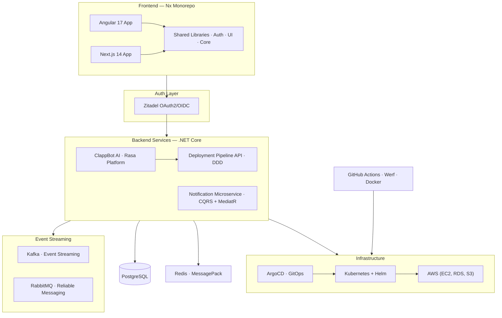
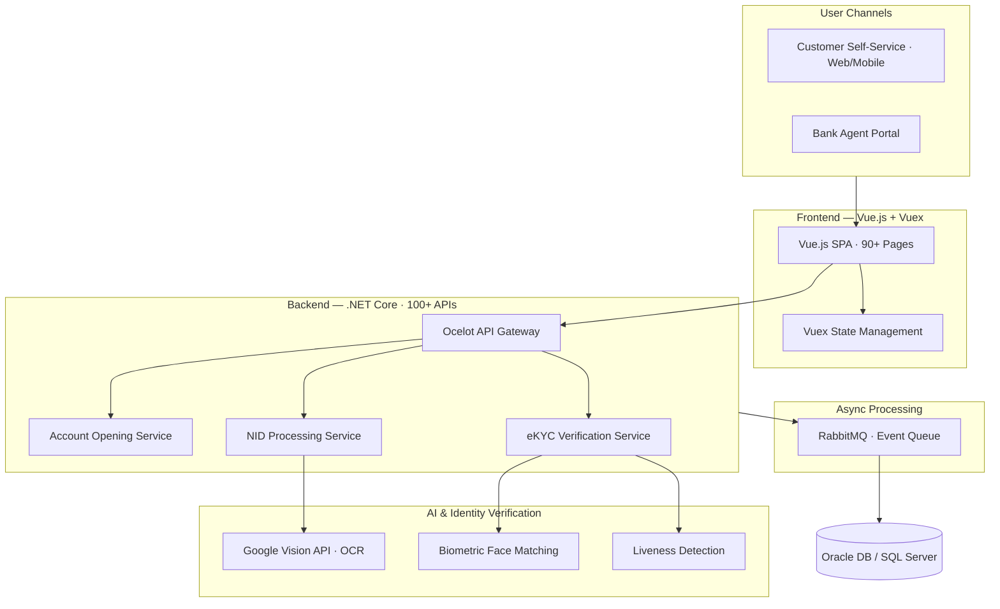
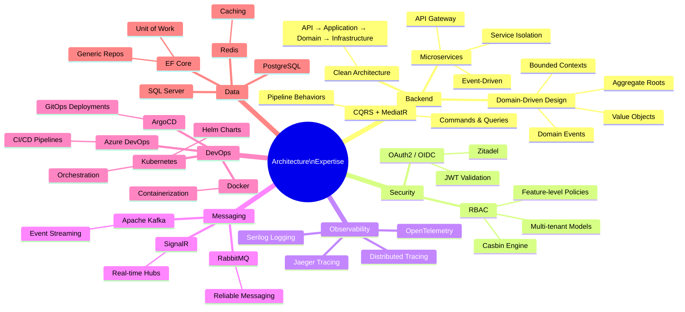

<h1 align="center">
  
</h1>

<p align="center">
  <a href="https://www.linkedin.com/in/sarkeranik"></a>
  <a href="https://github.com/sarkeranik"></a>
  <a href="mailto:ach6266@gmail.com"></a>
  <a href="https://anik-sarker.io"></a>
  
</p>

<p align="center">
  <b>Senior Software Engineer · .NET 8 · Angular · Microservices · DDD · CQRS · Clean Architecture</b><br/>
  <sub>6+ years building scalable, secure cloud-native platforms · Currently @ BMW Group Malaysia 🚗</sub>
</p>

---

## 🧭 About Me

```text
🏢  Currently    BMW Group Malaysia — Senior Software Developer (Jul 2025 – Present)
                 Engineering high-performance API ecosystems for global automotive financial platforms
📍  Location     Kuala Lumpur, Malaysia
🏗️  Specialty    Distributed systems · DDD · CQRS · Clean Architecture · Enterprise SaaS
🎓  Education    BSc Computer Science — AIUB (GPA 3.58 / 4.0)
🏆  Recognition  "A Significant Contributor" — LEADS Corporation (2021)
📜  Certified    nopCommerce Certified Developer — 98% score (Feb 2022)
🗣️  Languages    English (Fluent) · Bengali (Native)
```

> *"I build architectures that are resilient by design — grounded in DDD, CQRS, and Clean Architecture principles. Not just code, but ownership end-to-end: from system design to production."*

---

## ⚡ Impact Highlights

| Metric | Project |
|--------|---------|
| 🤖 **+70% user engagement** via AI chatbot (ClappBot) | Clappit Cloud SaaS |
| 👥 **100,000+ weekly visitors** served reliably | Apex E-Commerce |
| ⚡ **10,000+ concurrent users** at peak | Apex · Shwapno · Sailor |
| 🕐 **Days → Minutes** digital onboarding time | 3 bank eKYC platforms |
| 🏥 **Zero-downtime** real-time hospital asset tracking | MIRA |
| 🔒 **500K+ monthly transactions** audited & secure | GSK Expense Management |
| 🏅 **"Significant Contributor" Award** | LEADS Corporation (2021) |
| 📊 **98% Certified** nopCommerce Developer | Brain Station 23 (2022) |

---

## 🛠️ Tech Stack

### Backend


-6366F1?style=flat-square&logoColor=white)


### Architecture & Patterns


### Frontend
-DD0031?style=flat-square&logo=angular&logoColor=white)


### Cloud & DevOps


### Security & Auth


### Data & Messaging


### Observability


---

## 🗓️ Career Timeline



---

## 💼 Professional Experience

### 🚗 BMW Group Malaysia — Senior Software Developer
**Jul 2025 – Present · Cyberjaya, Selangor · Hybrid**

Engineering high-performance backend API ecosystems for global automotive financial platforms.

- Designing scalable **RESTful APIs** and microservices with **.NET 8** and **Clean Architecture** (API → Application → Domain → Infrastructure)
- Implementing **CQRS with MediatR** and rich **DDD** domain models for complex financial transaction logic
- Securing enterprise endpoints with **OAuth2/OIDC**, JWT, and fine-grained **RBAC**
- Optimizing **EF Core** queries with SQL Server/PostgreSQL — transaction safety, Unit of Work, index tuning
- Orchestrating async pipelines with **RabbitMQ/Kafka** and **Hangfire** background jobs
- Zero-downtime **CI/CD** via **Azure DevOps** with full API observability and **Swagger/OpenAPI** documentation



---

### 🏥 MIRA — Hospital Asset Tracking · Technical Lead @ Sweya AI
**Jan 2025 – Jun 2025 · India · Remote**

Production-grade **real-time indoor asset tracking platform** for hospitals — enabling organizations to track, secure, and optimize physical assets with live location data and enterprise-grade security.

**Key achievements:**
- Architected full system from scratch — Clean Architecture backend, modular Angular frontend, full DevOps pipeline
- Implemented **Zitadel OAuth2/OIDC** + **RBAC** multi-tenant security model
- Set up **OpenTelemetry + Jaeger** distributed tracing for proactive incident detection
- Zero-downtime production deployments with rolling updates via Docker + Werf



**Stack:** `.NET 8` `Clean Architecture` `Angular` `NgRx` `SignalR` `ECharts` `Syncfusion` `Zitadel` `OAuth2/OIDC` `PostgreSQL` `OpenTelemetry` `Jaeger` `Docker` `Jest` `Cypress`

---

### 💊 GSK Expense Management System · Sr. SE → Tech Lead @ Sweya AI
**Apr 2023 – Jan 2025 · India · Remote**

Enterprise-grade **Expense Management System** for GlaxoSmithKline — one of the world's leading pharmaceutical companies. Streamlines end-to-end expense workflows at scale with real-time notifications and audit-ready compliance.

**Key achievements:**
- Architected DDD backend with **Casbin RBAC** for fine-grained, policy-driven authorization
- Built **SignalR** real-time notification infrastructure — instant approval updates, zero polling
- Fully auditable platform with immutable audit trails for all 500K+ monthly transactions
- **Casbin RBAC policies** flexible enough to change permissions without code deployments



**Stack:** `.NET` `DDD` `CQRS` `MediatR` `Casbin RBAC` `EF Core` `PostgreSQL` `Hangfire` `SignalR` `Zitadel` `Angular 17` `PrimeNG` `OpenTelemetry`

---

### ☁️ Clappit — Cloud Infrastructure SaaS · Founding Engineer @ Sweya AI
**Aug 2022 – Apr 2023 · India · Remote**

AI-powered cloud infrastructure SaaS enabling teams to manage, deploy, and monitor cloud resources through a unified interface. As **Founding Engineer**, I shaped the technical direction and delivered the platform end-to-end.

**Key achievements:**
- Built **ClappBot** — an AI-powered deployment chatbot (Rasa) that drove **+70% user engagement**
- Architected **Nx monorepo** spanning Angular 17 + Next.js 14 with shared libraries
- Delivered a **multi-tenant notification microservice** (Email/SMS/Push) with Kafka + RabbitMQ
- **ArgoCD GitOps** with self-healing, auto-rollbacks, and Helm chart management



**Stack:** `.NET Core` `Angular 17` `Next.js 14` `Nx Monorepo` `Kubernetes` `Docker` `ArgoCD` `Helm` `Kafka` `RabbitMQ` `AWS` `Rasa AI` `OpenTelemetry`

---

### 🏦 Banking & FinTech eKYC Platforms · @ LEADS Corporation
**Jan 2020 – Oct 2021 · Dhaka, Bangladesh**

Modernized legacy banking systems and built digital-first financial products for **Dhaka Bank**, **IPDC Finance**, and **Southeast Bank** — enabling fully digital customer onboarding with AI-powered identity verification.

**Key achievements:**
- Built **90+ SPA pages** (Vue.js) and **100+ RESTful APIs** for internet banking & eKYC
- Integrated **Google Vision AI** for OCR document extraction and biometric face matching
- Reduced customer onboarding from days to **minutes** via instant account issuance
- Awarded **"A Significant Contributor"** for delivering the next-gen Core Banking System



**Stack:** `.NET Core` `Vue.js` `Vuex` `Google Vision AI` `OCR` `Biometric` `Ocelot` `RabbitMQ` `Oracle DB` `PL/SQL` `Microservices`

---

### 🛒 E-Commerce Platforms · @ Brain Station 23
**Nov 2021 – Jul 2022 · Bangladesh**

Shipped production e-commerce platforms for **Apex Footwear**, **Shwapno (ACI Logistics)**, and **Sailor Clothing** using nopCommerce — collectively serving hundreds of thousands of monthly active users.

| Platform | Client | Key Achievement |
|----------|--------|-----------------|
| **Apex** | Apex Footwear Ltd. | 100K+ weekly visitors · Facebook API integration |
| **Shwapno** | ACI Logistics | AWS Auto Scaling · Redis caching · high availability |
| **Sailor** | Sailor Clothing | Knawat API integration · multi-vendor catalog |

**Key achievements:**
- Contributed to the **nopCommerce open-source framework** — custom Plugins and Themes
- **98% score** on nopCommerce Certified Developer exam
- Improved performance **40%** through Redis caching and AWS auto-scaling (EC2, RDS, S3)

**Stack:** `.NET Core` `nopCommerce` `Angular` `SQL Server` `Redis` `Docker` `AWS` `Azure CI/CD`

---

## 🎓 Academic Research Projects

### 🔬 Computer Vision Research — AIUB (2019–2020)
**"Dynamic Recovering of Body Configurations by Combining Segmentation and Recognition"**

Research focused on **human pose estimation** — combining segmentation algorithms with recognition models to dynamically recover body configurations from image sequences.

| Aspect | Detail |
|--------|--------|
| Domain | Computer Vision · Human Pose Estimation |
| Methods | Image Segmentation · Recognition Models · Dynamic Configuration |
| Tools | Python · OpenCV · Machine Learning frameworks |
| Outcome | Published research paper on hybrid segmentation + recognition approach |

---

### 🧠 Data Mining & Machine Learning Projects — AIUB (2019–2020)

| Project | Type | Algorithm | Domain |
|---------|------|-----------|--------|
| **Heart Disease Finder** | Supervised ML | Classification | Healthcare |
| **Breakfast Suggester** | Unsupervised ML | Clustering (k-means) | Dietary recommendation |

---

## 📁 Featured Projects

> **15 projects · 13 in production · 6 industries** · Click any project title to view full details, architecture diagrams & live links.

---

### 🏢 Enterprise & SaaS Platforms

| # | Project | Role | Period | Live | Key Result |
|---|---------|------|--------|------|-----------|
| 1 | [🚗 **BMW Financial Platform APIs**](./projects/bmw-financial-apis.md) | Senior Software Developer | Jul 2025 – Present | [](https://bmwfinance.myaccount.co.za/login) | Global automotive financial platform · .NET 8 + CQRS + DDD |
| 2 | [🏥 **MIRA — Hospital Asset Tracking**](./projects/mira-hospital-asset-tracking.md) | **Technical Lead** | Jan–Jun 2025 | [](https://sweya.ai/products/mira) | **85% overhead reduction** · .NET 8 · Angular · OpenTelemetry |
| 3 | [💊 **GSK Expense Management**](./projects/gsk-expense-management.md) | Sr. SE → Tech Lead | Apr 2023–Jan 2025 | [](https://sweya.ai/products/regulatory-ai) | **500K+ transactions/month** · DDD · Casbin RBAC · SignalR |
| 4 | [📦 **GSK Order Management**](./projects/gsk-order-management.md) | Sr. SE → Tech Lead | Apr 2023–Jan 2025 | [](https://sweya.ai/products/regulatory-ai) | Kafka event-driven pipeline · CQRS · ArgoCD GitOps |
| 5 | [☁️ **Clappit — Cloud Infrastructure SaaS**](./projects/clappit-cloud-saas.md) | **Founding Engineer** | Aug 2022–Apr 2023 | [](https://sweya.ai/products/clappit) | **+70% engagement** via ClappBot AI · 100K+ concurrent users |

---

### 🏦 Banking & FinTech

| # | Project | Role | Period | Live | Key Result |
|---|---------|------|--------|------|-----------|
| 6 | [🔐 **VerifID — Digital eKYC**](./projects/verifid-ekyc.md) | Technical Lead | 2024–2025 | [](https://sweya.ai/verifid) | Multi-tenant SaaS · 3 banks · Days → **5 minutes** |
| 7 | [🏦 **Dhaka Bank EZYBANK**](./projects/dhaka-bank-ezybank.md) | Assoc. SE | Jan 2020–Oct 2021 | [](https://ezybank.dhakabank.com.bd/ekyc/Home/Login) | **Instant account issuance** · Google Vision AI · eKYC |
| 8 | [🏧 **IPDC Finance eKYC**](./projects/ipdc-finance-ekyc.md) | Assoc. SE | Jan 2020–Oct 2021 | [](https://ipdc.com/) | OCR + NLP + Biometric · AWS S3 document storage |
| 9 | [🏦 **Southeast Bank eKYC**](./projects/southeast-bank-ekyc.md) | Assoc. SE | Jan 2020–Oct 2021 | [](https://www.southeastbank.com.bd/?page=seb_mobile_app) | Bangladesh Bank compliant · Face Matching + Liveness |
| 10 | [🏛️ **Core Banking Modernisation**](./projects/core-banking-modernisation.md) | Assoc. SE | Jan 2020–Oct 2021 | [](https://leads.com.bd/banking-solutions/core-banking-solution/) | 90+ pages · 100+ APIs · **50%+ perf** · 🏆 Award |

---

### 🛒 E-Commerce Platforms

| # | Project | Role | Period | Live | Key Result |
|---|---------|------|--------|------|-----------|
| 11 | [👟 **Apex Footwear**](./projects/apex-footwear.md) | Assoc. SE | Nov 2021–Jul 2022 | [](https://www.apex4u.com/) | **100K+ weekly visitors** · Facebook Shop · Knawat API |
| 12 | [🛒 **Shwapno**](./projects/shwapno-retail.md) | Assoc. SE | Nov 2021–Jul 2022 | [](https://www.shwapno.com/) | **10K+ concurrent users** · AWS Auto Scaling · Redis |
| 13 | [👗 **Sailor Clothing**](./projects/sailor-clothing.md) | Assoc. SE | Nov 2021–Jul 2022 | [](https://www.sailor.clothing/) | Knawat dropshipping · Facebook Shop · Custom plugins |

---

### 🎓 Academic & Research

| # | Project | Institution | Year | Domain |
|---|---------|------------|------|--------|
| 14 | [🔬 **Computer Vision Research**](./projects/computer-vision-research.md) | AIUB | 2019–2020 | Human Pose Estimation · Segmentation + Recognition hybrid pipeline |
| 15 | [🧠 **Data Mining & ML**](./projects/data-mining-ml.md) | AIUB | 2019–2020 | Heart Disease Classifier (supervised) · Breakfast Suggester (K-Means) |

---


## 🧱 Architecture Expertise

My architectural approach across all projects follows a consistent set of battle-tested principles:



---

## 📊 GitHub Stats

<p align="center">
  
  
</p>

<p align="center">
  
</p>

---

## 🏅 Certifications & Recognition

| Certification / Award | Issuer | Date | Score |
|-----------------------|--------|------|-------|
| 🏆 **"A Significant Contributor" Award** | LEADS Corporation | Sep 2021 | — |
| 📜 **nopCommerce Certified Developer** | nopCommerce | Feb 2022 | **98%** |
| 🎓 **BSc Computer Science** | AIUB | 2020 | GPA 3.58/4.0 |

---

## 🤝 Let's Connect

<p align="center">
  <a href="https://www.linkedin.com/in/sarkeranik">
    
  </a>
  &nbsp;
  <a href="mailto:ach6266@gmail.com">
    
  </a>
  &nbsp;
  <a href="https://github.com/sarkeranik">
    
  </a>
  &nbsp;
  <a href="https://anik-sarker.io">
    
  </a>
</p>

<p align="center">
  <sub>📍 Kuala Lumpur, Malaysia · Open to senior engineering roles, architecture discussions & collaborations</sub>
</p>

---

<p align="center">
  
</p>
