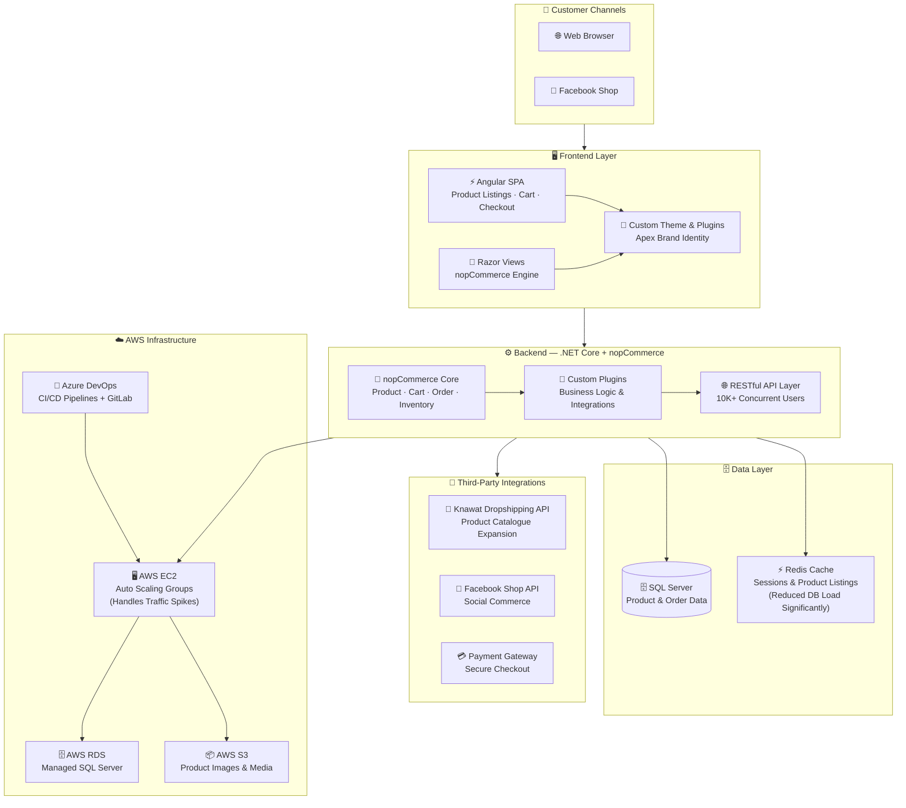

# 👟 Apex Footwear & Lifestyle E-Commerce

### High-Traffic Retail Platform · 100K+ Weekly Visitors

[← Back to Profile](../GITHUB_PROFILE.md) · [← All Projects](../PROJECTS_INDEX.md)

---

## 📋 TL;DR

> Full-featured e-commerce platform for **Apex Footwear Limited** — one of Bangladesh's leading footwear and lifestyle brands — serving **100,000+ weekly visitors** reliably. Built on nopCommerce + .NET Core + Angular, with AWS Auto Scaling, Redis caching, Facebook Shop and Knawat API integrations. Contributed custom plugins back to the nopCommerce open-source project.

| | |
|---|---|
| **Company** | Brain Station 23 |
| **Client** | Apex Footwear Limited |
| **Role** | Associate Software Engineer |
| **Period** | Nov 2021 – Jul 2022 |
| **Domain** | Fashion & Footwear E-Commerce |
| **Traffic** | 100,000+ weekly visitors |
| **Concurrency** | 10,000+ concurrent users at peak |

---

## 🎯 Key Contributions

- Built and deployed custom **nopCommerce Plugins** and **Themes** tailored to Apex's brand identity, serving **100,000+ weekly visitors**
- Engineered robust **RESTful APIs** with **.NET Core** supporting up to **10,000 concurrent visitors**
- Integrated **Facebook Shop APIs** — opened social commerce as a new digital sales channel
- Integrated **Knawat Dropshipping APIs** — expanded product catalogue without inventory overhead
- Implemented **Redis caching** for session management and frequently accessed product data
- Leveraged **AWS Auto Scaling** (EC2, RDS, S3) to handle traffic spikes during sales events
- Deployed via **Azure DevOps CI/CD** with GitLab-based branching workflows
- Contributed custom Plugins back to the **nopCommerce open-source framework** — adopted across multiple client storefronts
- Achieved **98% score** on the nopCommerce Certified Developer exam (Feb 2022)

---

## 🏗️ Architecture

---

## 🛠️ Tech Stack

| Layer | Technologies |
|-------|-------------|
| **E-Commerce Platform** | nopCommerce |
| **Backend** | .NET Core, C#, ASP.NET Core, Entity Framework |
| **Frontend** | Angular, TypeScript, HTML5, CSS3, Razor Views |
| **Database** | Microsoft SQL Server |
| **Caching** | Redis — sessions + product listings |
| **Third-Party** | Knawat Dropshipping API, Facebook Shop API |
| **Cloud** | AWS (EC2, RDS, S3), Auto Scaling |
| **DevOps** | Azure DevOps, GitLab CI/CD |

---

## 📊 Impact

| Metric | Result |
|--------|--------|
| **Weekly Traffic** | **100,000+ visitors** served reliably |
| **Concurrency** | APIs supporting up to **10,000 concurrent users** |
| **Sales Channels** | Facebook Shop integration expanded digital reach |
| **Certification** | **98% score** — nopCommerce Certified Developer (Feb 2022) |
| **Open Source** | Custom plugins contributed back to nopCommerce framework |

---

## 🏷️ Skills Demonstrated

`nopCommerce` `.NET Core` `ASP.NET Core` `C#` `Angular` `TypeScript` `SQL Server` `Entity Framework` `Redis` `Knawat API` `Facebook Shop API` `AWS EC2` `AWS RDS` `AWS S3` `Auto Scaling` `Azure DevOps` `GitLab CI/CD` `REST API`

---

[← Back to Profile](../GITHUB_PROFILE.md) · [📁 All Projects](../PROJECTS_INDEX.md) · [💼 LinkedIn](https://linkedin.com/in/sarkeranik) · [📧 Contact](mailto:ach6266@gmail.com)

