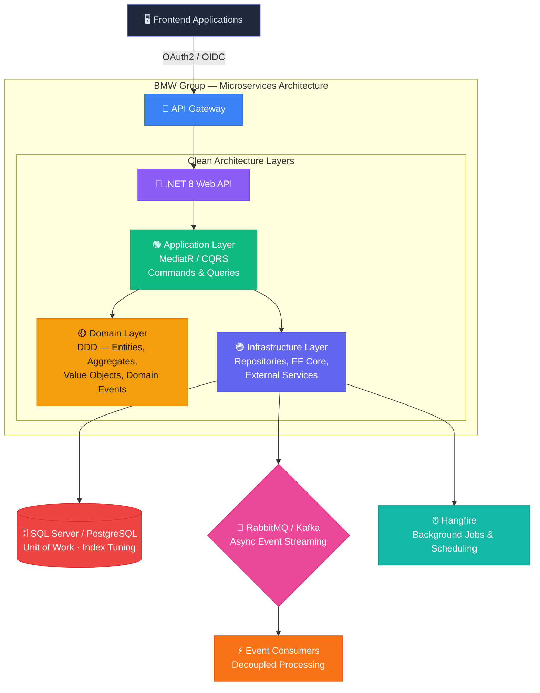

# 🚗 BMW Financial Platform APIs

### High-Performance API Ecosystems for Global Automotive Finance

[← Back to Profile](../GITHUB_PROFILE.md) · [← All Projects](../PROJECTS_INDEX.md)

---

## 📋 TL;DR

> Engineering **high-performance backend API ecosystems** for global automotive financial platforms at BMW Group Malaysia. Clean Architecture + CQRS + DDD with full Azure DevOps CI/CD, OAuth2/OIDC security, and event-driven RabbitMQ/Kafka pipelines.

| | |
|---|---|
| **Company** | BMW Group Malaysia |
| **Location** | Cyberjaya, Selangor · Hybrid |
| **Role** | Senior Software Developer |
| **Period** | Jul 2025 – Present |
| **Domain** | Automotive Financial Services |
| **Stack Core** | .NET 8 · Clean Architecture · CQRS · DDD · Azure DevOps |

---

## 🎯 What I'm Building

Engineering robust, high-performance backend APIs for **global automotive financial platforms** as part of a distributed Agile engineering team.

- Designing scalable **RESTful APIs** and microservices using **.NET 8** + ASP.NET Core adhering to **Clean Architecture** (API → Application → Domain → Infrastructure isolation)
- Implementing **CQRS with MediatR** + rich **Domain-Driven Design** domain models for complex financial transaction logic
- Securing enterprise-grade endpoints with **OAuth2 / OIDC**, JWT validation, and fine-grained **RBAC**
- Optimizing **EF Core** queries — LINQ optimization, Unit of Work, transaction safety, and index tuning for high throughput
- Orchestrating asynchronous pipelines with **RabbitMQ / Kafka** and **Hangfire** background jobs
- Driving zero-downtime **CI/CD** via **Azure DevOps** with complete **Swagger/OpenAPI** observability

---

## 🏗️ Architecture

---

## 🛠️ Tech Stack

| Category | Technologies |
|----------|-------------|
| **Backend Framework** | .NET 8, ASP.NET Core Web API, C# |
| **Architecture Patterns** | Microservices, Clean Architecture, Domain-Driven Design (DDD), CQRS |
| **CQRS Implementation** | MediatR — Commands, Queries, Pipeline Behaviors |
| **Security & Auth** | OAuth2, OpenID Connect (OIDC), JWT Validation, RBAC |
| **Database & ORM** | SQL Server, PostgreSQL, Entity Framework Core, Unit of Work, Dapper |
| **Async / Messaging** | RabbitMQ, Apache Kafka, Hangfire Background Jobs |
| **DevOps & CI/CD** | Azure DevOps, Docker, Zero-downtime deployments |
| **Observability** | Serilog Structured Logging, Swagger/OpenAPI Documentation |

---

## 📊 Impact

| Metric | Detail |
|--------|--------|
| **Scale** | Supporting global automotive financial platforms |
| **Reliability** | Zero-downtime deployment pipelines via Azure DevOps |
| **Performance** | Optimized high-throughput EF Core queries + event-driven architecture |
| **Security** | Enterprise-grade OAuth2/OIDC + RBAC enforcement across all endpoints |

---

## 🏷️ Skills Demonstrated

`.NET 8` `.ASP.NET Core` `C#` `Microservices` `Clean Architecture` `Domain-Driven Design` `CQRS` `MediatR` `Azure DevOps` `OAuth2/OIDC` `JWT` `RBAC` `EF Core` `SQL Server` `PostgreSQL` `RabbitMQ` `Kafka` `Hangfire` `Enterprise Software`

---

[← Back to Profile](../GITHUB_PROFILE.md) · [📁 All Projects](../PROJECTS_INDEX.md) · [💼 LinkedIn](https://linkedin.com/in/sarkeranik) · [📧 Contact](mailto:ach6266@gmail.com)

