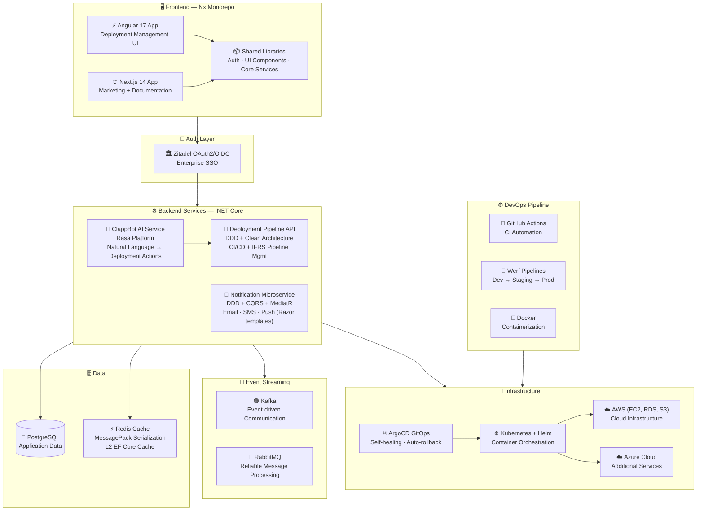

<div align="center">

# ☁️ Clappit — Cloud Infrastructure SaaS

### AI-Powered Cloud Deployment & Management Platform

[](https://sweya.ai/products/clappit)
[](https://sweya.ai/products/clappit)
[]()
[]()
[]()
[]()
[]()

[← Back to Profile](../GITHUB_PROFILE.md) · [← All Projects](../PROJECTS_INDEX.md)

</div>

---

## 📋 TL;DR

> As **Founding Engineer**, I architected and shipped an AI-powered cloud infrastructure SaaS from zero to production — Nx monorepo frontend (Angular 17 + Next.js 14), DDD .NET backend, multi-tenant notification microservice, and **ClappBot** (Rasa AI chatbot) that drove **+70% user engagement**. Scaled to **100K+ concurrent users**.

| | |
|---|---|
| **Company** | Sweya AI |
| **Role** | Founding Engineer → Software Engineer |
| **Period** | Aug 2022 – Apr 2023 |
| **Domain** | Cloud Infrastructure · DevOps · SaaS |
| **AI Feature** | ClappBot — Rasa AI deployment chatbot |
| **Key Result** | +70% user engagement after ClappBot launch |

---

## 🤖 ClappBot — The AI Chatbot That Drove 70% Growth

ClappBot is a **conversational AI interface** built on the **Rasa platform**, enabling users to manage cloud deployments through natural language commands:

```
User: "Deploy my staging pipeline with the latest build"
ClappBot: "Deploying staging-pipeline-v2.3.1 → Kubernetes cluster... ✅ Done in 48s"

User: "Roll back production to last stable"
ClappBot: "Rolling back prod to v2.2.9 via ArgoCD... ✅ Rollback complete"
```

This eliminated the need to navigate complex UI dashboards for common deployment operations — driving a measured **70% increase in user engagement** post-launch.

---

## 👨‍💼 My Role as Founding Engineer

- Defined the **technical architecture** and engineering standards from day zero
- Architected and shipped the **Nx monorepo** frontend (Angular 17 + Next.js 14) with shared libraries
- Built the **DDD backend** for CI/CD pipeline and deployment management
- Designed the **multi-tenant notification microservice** (Email/SMS/Push) with Kafka + RabbitMQ
- Delivered **ClappBot** — AI chatbot for conversational infrastructure operations
- Established **CI/CD pipelines** (GitHub Actions, Werf) across dev, staging, and production

---

## 🏗️ Architecture



---

## 🛠️ Tech Stack

| Layer | Technologies |
|-------|-------------|
| **Frontend** | Angular 17, Next.js 14, Nx Monorepo, TypeScript |
| **Shared Libraries** | Nx shared — Auth, Core Services, UI Components |
| **Backend** | .NET Core, ASP.NET Core Web API, MediatR (CQRS) |
| **Architecture** | DDD, Clean Architecture, Microservices |
| **AI Chatbot** | Rasa Platform (ClappBot) — NLU + Dialogue Management |
| **Auth** | Zitadel, OAuth2/OIDC, JWT |
| **Event Streaming** | Apache Kafka — event-driven communication |
| **Messaging** | RabbitMQ — reliable message processing |
| **Caching** | Redis + MessagePack + EFCoreSecondLevelCacheInterceptor |
| **Database** | PostgreSQL |
| **DevOps** | Docker, Kubernetes, Helm, ArgoCD, Werf, GitHub Actions |
| **Cloud** | AWS (EC2, RDS, S3), Microsoft Azure |
| **Observability** | OpenTelemetry, Serilog |

---

## 📊 Impact

| Metric | Result |
|--------|--------|
| **User Engagement** | **+70%** following ClappBot AI chatbot launch |
| **Concurrent Users** | Scaled to handle **100K+** concurrent users |
| **Role** | Founding Engineer — defined architecture & standards from day one |
| **Environments** | Multi-environment pipelines (dev → staging → prod) with automated rollback |
| **Platform** | Served multiple enterprise cloud infrastructure clients |

---

## 🏷️ Skills Demonstrated

`.NET Core` `Angular 17` `Next.js 14` `Nx Monorepo` `Kubernetes` `Docker` `ArgoCD` `Helm` `Kafka` `RabbitMQ` `Redis` `PostgreSQL` `AWS` `OAuth2/OIDC` `DDD` `CQRS` `MediatR` `Werf` `GitHub Actions` `OpenTelemetry` `Microservices` `Rasa AI`

---

<div align="center">

[← Back to Profile](../GITHUB_PROFILE.md) · [📁 All Projects](../PROJECTS_INDEX.md) · [💼 LinkedIn](https://linkedin.com/in/sarkeranik) · [📧 Contact](mailto:ach6266@gmail.com)

</div>
