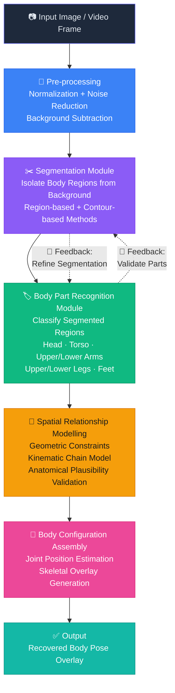

# 🔬 Computer Vision Research

### Dynamic Recovering of Body Configurations by Combining Segmentation and Recognition

[← Back to Profile](../GITHUB_PROFILE.md) · [← All Projects](../PROJECTS_INDEX.md)

---

## 📋 TL;DR

> Academic research investigating **dynamic recovery of human body configurations** by combining image segmentation and body part recognition — proposing a hybrid pipeline that outperforms either approach independently, especially under occlusion conditions. Includes kinematic constraint validation for anatomically plausible pose reconstruction.

| | |
|---|---|
| **Institution** | American International University-Bangladesh (AIUB) |
| **Research Group** | Computer Vision Research Group |
| **Year** | 2019 – 2020 |
| **Domain** | Computer Vision · Human Pose Estimation · Machine Learning |
| **Output** | Research paper — hybrid segmentation + recognition pipeline |

---

## 🎯 Problem Statement

Human body configuration recovery is a **foundational challenge in computer vision**, with real-world applications in:

| Domain | Application |
|--------|-------------|
| 🏥 **Healthcare** | Patient posture monitoring, rehabilitation tracking, fall detection |
| ⚽ **Sports Analytics** | Motion analysis, biomechanics, technique correction |
| 🖥️ **Human-Computer Interaction** | Gesture-based interfaces, AR/VR |
| 🔍 **Surveillance** | Activity recognition, anomaly detection |

**The gap:** Existing approaches relied on *either* segmentation (losing semantic body-part relationships) *or* recognition (losing spatial context). This research proposes a **hybrid approach** that addresses both limitations.

---

## 🔬 Research Methodology

---

## 🧪 Pipeline Stages Explained

### Stage 1 · Pre-processing
Input images are normalized and filtered to reduce noise. Background subtraction simplifies the segmentation task by separating the subject from irrelevant regions.

### Stage 2 · Segmentation
Image segmentation isolates the human figure from background and partitions the body into candidate regions — each potentially corresponding to a body part. Explores both region-based and contour-based segmentation methods.

### Stage 3 · Body Part Recognition
Segmented regions are fed into a **CNN classification model** trained to identify body parts. Recognition provides semantic labels to each spatial region — head, torso, upper arm, forearm, upper leg, lower leg, feet.

### Stage 4 · Spatial Relationship Modelling
Recognized parts are assembled using geometric constraints and a simplified **kinematic chain model** — ensuring reconstructed poses are anatomically plausible (correct limb proportions, joint angles within valid anatomical ranges).

### Stage 5 · Configuration Recovery
Final stage synthesizes spatial data (from segmentation) + semantic labels (from recognition) into a complete body configuration — estimating joint positions and producing a skeletal overlay on the original image.

---

## 🔑 Key Findings

| Finding | Detail |
|---------|--------|
| **Hybrid > Single Approach** | Combining segmentation + recognition produced more robust estimates than either method independently — especially under partial occlusion |
| **Feedback Loops Work** | Bidirectional feedback between modules improved accuracy by refining ambiguous region classifications iteratively |
| **Kinematic Constraints Matter** | Anatomical constraints eliminated implausible pose estimates that pure ML classifiers sometimes produced |

---

## 🛠️ Technologies & Tools

| Category | Tools / Techniques |
|----------|--------------------|
| **Programming** | Python, MATLAB |
| **Computer Vision** | OpenCV, image segmentation, feature extraction |
| **Machine Learning** | Supervised classification, CNN-based recognition |
| **Body Modelling** | Kinematic chain models, geometric constraints |
| **Data** | Publicly available human pose datasets |

---

## 💼 Connection to Professional Work

> This research directly shaped my professional trajectory:
>
> - **AI pipelines** — foundational understanding that later guided Google Vision AI integrations in eKYC projects
> - **Hybrid architectures** — the mindset of combining complementary approaches is visible in every distributed system I've designed
> - **AI-assisted decisions** — intuition for AI-assisted systems appears in ClappBot (Rasa AI) and biometric verification systems

---

## 🏷️ Skills Demonstrated

`Computer Vision` `Image Segmentation` `Machine Learning` `CNN Classification` `Kinematic Modelling` `Python` `MATLAB` `OpenCV` `Feature Extraction` `Research & Publication` `Human Pose Estimation`

---

[← Back to Profile](../GITHUB_PROFILE.md) · [📁 All Projects](../PROJECTS_INDEX.md) · [💼 LinkedIn](https://linkedin.com/in/sarkeranik) · [📧 Contact](mailto:ach6266@gmail.com)

