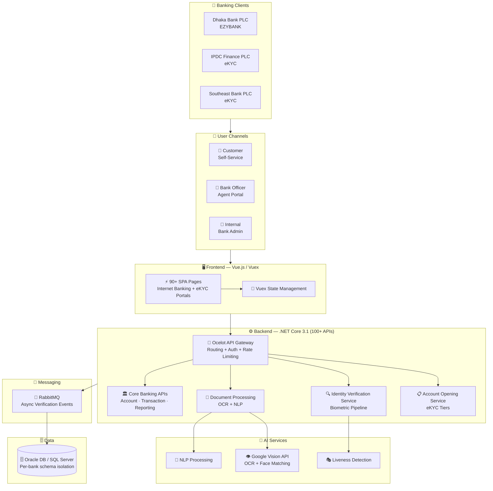

<div align="center">

# 🏛️ Core Banking System Modernisation

### Next-Gen Digital Banking Infrastructure at LEADS Corporation

[](https://leads.com.bd/banking-solutions/core-banking-solution/)
[](https://leads.com.bd/banking-solutions/core-banking-solution/)
[]()
[]()
[]()
[]()

[← Back to Profile](../GITHUB_PROFILE.md) · [← All Projects](../PROJECTS_INDEX.md)

</div>

---

## 📋 TL;DR

> Migrated legacy banking systems to modern **.NET Core 3.1 microservices** for LEADS Corporation, delivering the **Next-Gen Core Banking System** for multiple Bangladeshi banks. Built **90+ SPA pages** (Vue.js) and **100+ RESTful APIs**, resolved critical PL/SQL bottlenecks improving API response time by **50%+**, and was awarded **"A Significant Contributor"** in Sep 2021.

| | |
|---|---|
| **Company** | LEADS Corporation Limited |
| **Role** | Associate Software Engineer |
| **Period** | Jan 2020 – Oct 2021 |
| **Domain** | Core Banking · Digital Transformation |
| **Clients** | Dhaka Bank PLC · IPDC Finance PLC · Southeast Bank PLC |
| **Award** | 🏆 "A Significant Contributor" — LEADS Corporation (Sep 2021) |

---

## 🎯 The Transformation

```
BEFORE (Legacy System)                    AFTER (Modernized)
─────────────────────                     ──────────────────
❌ Monolithic .NET Framework              ✅ .NET Core 3.1 Microservices
❌ Tightly coupled codebase               ✅ Clean separation of concerns
❌ Branch-only customer onboarding        ✅ Fully digital eKYC onboarding
❌ Slow PL/SQL stored procedures          ✅ 50%+ API response time improvement
❌ Manual identity verification           ✅ AI-powered OCR + biometric matching
❌ Days to open a bank account            ✅ Minutes to complete digital onboarding
❌ No event-driven architecture           ✅ RabbitMQ async event processing
```

---

## 💼 Key Contributions

- **Migrated legacy banking systems** to modern **.NET Core 3.1 microservices** — enabling the next-generation Core Banking System
- Developed **90+ SPA pages** (Vue.js/Vuex) for internet banking and eKYC platforms across multiple banks
- Built **100+ RESTful backend APIs** — account management, eKYC, notifications, reporting
- Built the **Dhaka Bank EZYBANK** eKYC platform with simplified and regular account tiers
- Built the **IPDC Finance** and **Southeast Bank** eKYC platforms with AI biometric verification
- Integrated **Google Vision AI** for OCR document extraction and biometric face matching
- Set up **Ocelot API Gateway** for centralized routing, authentication, and API management
- Implemented **RabbitMQ** for asynchronous verification event processing
- Resolved critical security and performance bottlenecks in legacy **PL/SQL stored procedures** — improving average API response time by **50%+**
- Collaborated with multiple bank compliance and operations teams to validate workflows against Bangladesh Bank regulatory requirements
- Awarded **"A Significant Contributor"** by LEADS Corporation for delivering the next-gen Core Banking System

---

## 🏗️ Architecture



---

## 🛠️ Tech Stack

| Layer | Technologies |
|-------|-------------|
| **Backend** | .NET Core 3.1, ASP.NET Core Web API, C# |
| **Frontend** | Vue.js, Vuex, HTML5, CSS3 (90+ SPA pages) |
| **Auth** | JWT, OAuth2 |
| **AI / Vision** | Google Vision API, OCR, NLP, Biometric Matching, Liveness Detection |
| **API Gateway** | Ocelot — centralized routing, auth, rate limiting |
| **Messaging** | RabbitMQ — async verification event processing |
| **Database** | Oracle DB, Microsoft SQL Server |
| **ORM** | Entity Framework Core, Dapper |
| **Legacy** | PL/SQL stored procedures (performance optimization) |
| **Architecture** | Microservices, RESTful APIs |

---

## 📊 Impact

| Metric | Result |
|--------|--------|
| **API Response Time** | **50%+** improvement via PL/SQL optimization |
| **Pages Delivered** | **90+** SPA pages (Vue.js) |
| **APIs Built** | **100+** RESTful backend APIs |
| **Digital Transformation** | 3 banks fully digitized their customer onboarding process |
| **Recognition** | 🏆 **"A Significant Contributor"** Award — LEADS Corporation (Sep 2021) |

---

## 🏷️ Skills Demonstrated

`.NET Core 3.1` `ASP.NET Core` `C#` `Vue.js` `Vuex` `Google Vision API` `OCR` `NLP` `Biometric Matching` `Liveness Detection` `Ocelot API Gateway` `RabbitMQ` `Oracle DB` `SQL Server` `EF Core` `Dapper` `PL/SQL` `JWT` `OAuth2` `Microservices` `eKYC`

---

<div align="center">

[← Back to Profile](../GITHUB_PROFILE.md) · [📁 All Projects](../PROJECTS_INDEX.md) · [💼 LinkedIn](https://linkedin.com/in/sarkeranik) · [📧 Contact](mailto:ach6266@gmail.com)

</div>
