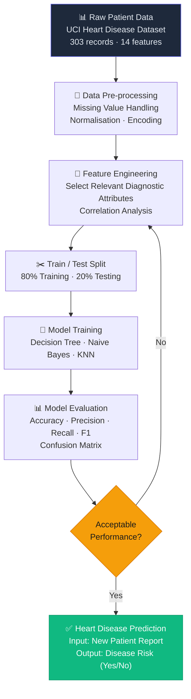
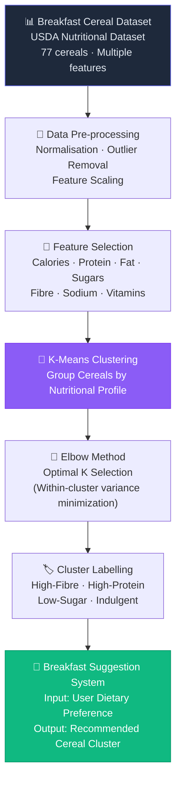

# 🧠 Data Mining & Machine Learning Projects

### Heart Disease Classification & Dietary Clustering Systems

[← Back to Profile](../GITHUB_PROFILE.md) · [← All Projects](../PROJECTS_INDEX.md)

---

## 📋 TL;DR

> Two ML systems demonstrating the full spectrum of classical machine learning: **Heart Disease Finder** (supervised classification — predicts heart disease risk from 14 patient features using Decision Tree, Naive Bayes, KNN) and **Breakfast Suggester** (unsupervised clustering — groups breakfast cereals by nutritional profile via K-Means for dietary recommendations).

| | |
|---|---|
| **Institution** | American International University-Bangladesh (AIUB) |
| **Course** | Data Warehouse and Data Mining |
| **Year** | 2019 – 2020 |
| **ML Approaches** | Supervised Classification + Unsupervised Clustering |
| **Datasets** | UCI Heart Disease Dataset · USDA Cereal Nutritional Dataset |

---

## 🫀 Project 1: Heart Disease Finder (Supervised ML)

### Overview

> **Goal:** Predict the likelihood of heart disease from patient diagnostic data — enabling early intervention for at-risk patients.

Heart disease is one of the leading causes of mortality worldwide. This system uses historical patient records from the **UCI Heart Disease Dataset** (303 patients, 14 features) to classify whether a patient is at risk.

### Diagnostic Features Used

| Feature | Description |
|---------|-------------|
| Age | Patient age in years |
| Sex | Biological sex |
| Chest Pain Type | 4 types of chest pain |
| Resting Blood Pressure | In mm Hg |
| Serum Cholesterol | In mg/dl |
| Fasting Blood Sugar | > 120 mg/dl |
| Resting ECG Results | Normal · ST-T wave abnormality · LVH |
| Max Heart Rate | Achieved during exercise |
| Exercise-Induced Angina | Yes/No |
| ST Depression | Induced by exercise vs rest |
| Peak Exercise ST Segment | Slope classification |
| Fluoroscopy Vessels | Number coloured |
| Thalassemia | Normal / Fixed defect / Reversible defect |

### ML Pipeline

### Algorithms Compared

| Algorithm | Rationale | Strength |
|-----------|-----------|----------|
| **Decision Tree** | Interpretable clinical rules | Explainability — clinicians can follow the decision path |
| **Naive Bayes** | Probabilistic baseline | Fast, strong baseline with probabilistic output |
| **K-Nearest Neighbours** | Instance-based proximity | Good for non-linear decision boundaries |

---

## 🥣 Project 2: Breakfast Suggester (Unsupervised ML)

### Overview

> **Goal:** Discover natural nutritional groupings in breakfast cereals to enable category-based dietary recommendations — without requiring labelled outcomes.

Dietary habits vary widely. K-Means clustering applied to the **USDA Breakfast Cereal Nutritional Dataset** (77 cereals, multiple nutritional dimensions) to discover hidden structure.

### Nutritional Features Analysed

| Feature | Unit |
|---------|------|
| Calories | kcal per serving |
| Protein | grams |
| Fat | grams |
| Sodium | mg |
| Dietary Fibre | grams |
| Sugar | grams |
| Potassium | mg |
| Vitamins | % daily value |

### ML Pipeline

### Algorithms Used

| Algorithm | Purpose |
|-----------|---------|
| **K-Means Clustering** | Partition cereals into distinct nutritional groups |
| **Elbow Method** | Determine optimal number of clusters (K) based on within-cluster variance |

---

## 🛠️ Technologies & Tools

| Category | Tools |
|----------|-------|
| **Programming** | Python |
| **Data Manipulation** | pandas, NumPy |
| **ML Library** | scikit-learn |
| **Visualization** | matplotlib, seaborn |
| **Supervised ML** | Decision Tree, Naive Bayes, K-Nearest Neighbours |
| **Unsupervised ML** | K-Means Clustering, Elbow Method |
| **Data Sources** | UCI Heart Disease Dataset, USDA Cereal Nutritional Dataset |
| **Evaluation Metrics** | Accuracy, Precision, Recall, F1-Score, Confusion Matrix, Silhouette Score |

---

## 💡 Key Learnings

- Hands-on experience applying both **supervised and unsupervised** ML pipelines end-to-end
- Full **data science workflow**: data cleaning → feature engineering → model training → evaluation → interpretation
- How to select algorithms based on whether labelled outcomes are available
- **Real-world ML applications**: healthcare diagnosis + personalized dietary recommendation systems
- Communicating ML results in **domain-accessible terms** (medical and nutritional)

---

## 💼 Connection to Professional Work

> These projects laid the foundation for AI-driven thinking in my professional work:
>
> - **Classification and prediction models** → informed how I integrated Google Vision AI for eKYC biometric verification
> - **Data-driven recommendation systems** → underpinned how I reasoned about ClappBot's AI intent classification
> - **Data science mindset** (hypothesis → pipeline → evaluation) → directly influences how I approach backend system design and observability

---

## 🏷️ Skills Demonstrated

`Python` `Machine Learning` `Data Mining` `Supervised Learning` `Unsupervised Learning` `Decision Tree` `Naive Bayes` `K-Nearest Neighbours` `K-Means Clustering` `pandas` `NumPy` `scikit-learn` `matplotlib` `seaborn` `Data Pre-processing` `Feature Engineering` `Model Evaluation`

---

[← Back to Profile](../GITHUB_PROFILE.md) · [📁 All Projects](../PROJECTS_INDEX.md) · [💼 LinkedIn](https://linkedin.com/in/sarkeranik) · [📧 Contact](mailto:ach6266@gmail.com)

