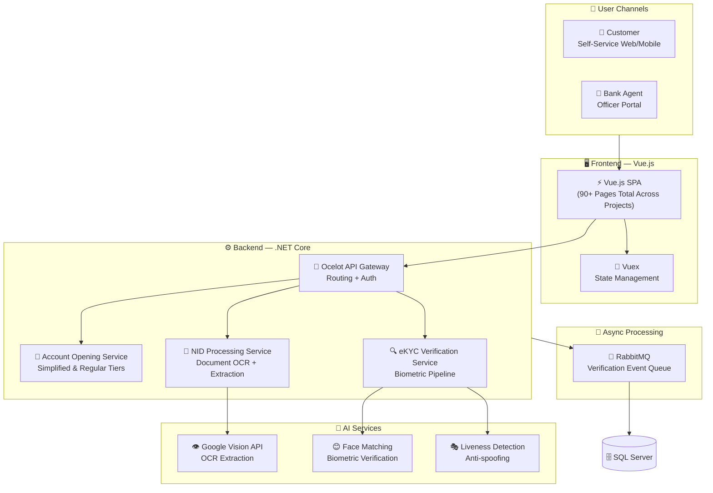

# 🏦 Dhaka Bank PLC — EZYBANK

### Digital Account Opening & eKYC Platform

[← Back to Profile](../GITHUB_PROFILE.md) · [← All Projects](../PROJECTS_INDEX.md)

---

## 📋 TL;DR

> **EZYBANK** is Dhaka Bank's flagship digital account opening platform — enabling customers to open a bank account **entirely online without visiting a branch**. Built with Vue.js + .NET Core microservices, integrating Google Vision AI for biometric NID verification and offering two compliance tiers per Bangladesh Bank regulations.

| | |
|---|---|
| **Company** | LEADS Corporation Limited |
| **Client** | Dhaka Bank PLC |
| **Role** | Associate Software Engineer |
| **Period** | Jan 2020 – Oct 2021 |
| **Domain** | Banking · Digital Identity · Financial Inclusion |
| **Key Feature** | Instant account issuance for Simplified eKYC tier |

---

## 🏛️ eKYC Account Tiers

| Account Type | Monthly Limit | Account Issuance |
|-------------|--------------|-----------------|
| **Simplified eKYC** | Deposits/Withdrawals ≤ BDT 1,00,000/month | Issued **instantly** after verification |
| **Regular eKYC** | Deposits/Withdrawals > BDT 1,00,000/month | Issued after full compliance review |

> Both tiers are fully compliant with **Bangladesh Bank's digital KYC guidelines** — enabling banks to onboard digitally while meeting regulatory requirements.

---

## 🎯 Key Features

- **NID Document OCR** — Automatically extracts customer data from national identity documents
- **Biometric Facial Matching** — Live camera capture matched against NID photo using AI image recognition
- **Instant Account Issuance** — Simplified eKYC customers receive an account number immediately on successful verification
- **Dual Onboarding Mode** — Customer self-service (web/mobile) or agent-assisted by bank officer
- **Regulatory Compliance** — Fully aligned with Bangladesh Bank's digital identity verification guidelines

---

## 🏗️ Architecture

---

## 🛠️ Tech Stack

| Layer | Technologies |
|-------|-------------|
| **Frontend** | Vue.js, Vuex, HTML5, CSS3 |
| **Backend** | .NET Core, ASP.NET Core Web API, EF Core, Dapper |
| **Auth** | JWT, OAuth2 |
| **AI / Vision** | Google Vision API, OCR, Biometric Matching, Liveness Detection |
| **API Gateway** | Ocelot — centralized routing and auth enforcement |
| **Messaging** | RabbitMQ — async verification event processing |
| **Database** | Microsoft SQL Server |
| **Architecture** | Microservices, RESTful APIs |

---

## 📊 Impact

| Metric | Result |
|--------|--------|
| **Process Digitization** | Eliminated in-branch visits for account opening |
| **Speed** | Instant account number issuance for simplified eKYC tier |
| **Compliance** | Fully aligned with Bangladesh Bank digital KYC regulations |
| **Accessibility** | Dual-mode onboarding (self-service + agent) served all customer segments |

---

## 🏷️ Skills Demonstrated

`.NET Core` `ASP.NET Core` `Vue.js` `Vuex` `Google Vision API` `OCR` `Biometric Matching` `Liveness Detection` `Ocelot API Gateway` `RabbitMQ` `SQL Server` `JWT` `Microservices` `eKYC`

---

[← Back to Profile](../GITHUB_PROFILE.md) · [📁 All Projects](../PROJECTS_INDEX.md) · [💼 LinkedIn](https://linkedin.com/in/sarkeranik) · [📧 Contact](mailto:ach6266@gmail.com)

