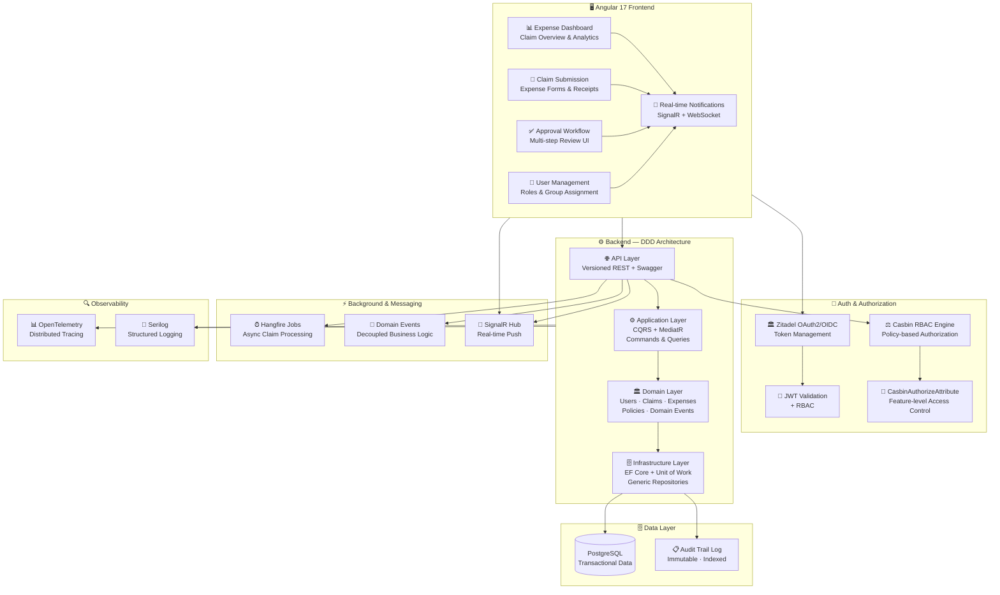

# 💊 GSK Expense Management System

### Enterprise Expense Workflow Platform for GlaxoSmithKline

[-8B5CF6?style=flat-square)]()

[← Back to Profile](../GITHUB_PROFILE.md) · [← All Projects](../PROJECTS_INDEX.md)

---

## 📋 TL;DR

> A secure, enterprise-grade **Expense Management System** for GlaxoSmithKline (GSK). Features DDD .NET backend with Casbin RBAC, real-time SignalR notifications, and full audit trails — handling **500K+ monthly transactions** with zero compliance gaps.

| | |
|---|---|
| **Company** | Sweya AI |
| **Client** | GlaxoSmithKline (GSK) — global pharma leader |
| **Role** | Senior Software Engineer → Technical Lead |
| **Period** | Apr 2023 – Jan 2025 |
| **Domain** | Healthcare · Enterprise Finance · Compliance |
| **Scale** | 500K+ monthly transactions |

---

## 🎯 What It Solves

- **Complex approval hierarchies** — multi-level expense claim workflows with role-specific actions
- **Audit compliance** — immutable audit trails for every action (regulatory requirement for pharma)
- **Real-time visibility** — instant SignalR notifications on claim status changes (no more email chains)
- **Fine-grained authorization** — Casbin RBAC policies per feature, not just per role
- **Multi-role orchestration** — Employee → Manager → Finance → Administrator workflows with branching logic

---

## 👨‍💼 My Role

- Architected the **DDD backend** from scratch — domain models, repositories, CQRS pipeline, and infrastructure layer
- Engineered a **Casbin-powered RBAC system** with `CasbinAuthorizeAttribute` for feature-level authorization
- Built **SignalR real-time notification infrastructure** for instant approval/status updates across the organization
- Contributed to the **Angular 17 frontend** — OAuth2 integration, HTTP interceptors, and Swagger-generated API clients
- Implemented enterprise **audit logging, domain events, and Unit of Work** patterns
- Integrated **OpenTelemetry + Serilog** for full production observability

---

## 🏗️ Architecture

---

## 🛠️ Tech Stack

| Layer | Technologies |
|-------|-------------|
| **Frontend** | Angular 17, TypeScript, PrimeNG, RxJS |
| **Real-time** | SignalR, WebSockets |
| **Auth** | Zitadel, OAuth2/OIDC, JWT |
| **Authorization** | Casbin RBAC Engine, `CasbinAuthorizeAttribute` |
| **Backend** | .NET, ASP.NET Core Web API, MediatR (CQRS) |
| **Architecture** | Domain-Driven Design, Clean Architecture, Domain Events |
| **ORM & Data** | Entity Framework Core, Unit of Work, Generic Repositories, Soft-delete |
| **Database** | PostgreSQL |
| **Background Jobs** | Hangfire — async claim processing, notifications, reporting |
| **Observability** | OpenTelemetry, Serilog |
| **API Tooling** | Swagger/OpenAPI, API Versioning, Custom Exception Middleware |

---

## 📊 Impact

| Metric | Result |
|--------|--------|
| **Monthly Volume** | **500K+** expense transactions processed securely |
| **Auditability** | Fully auditable platform — immutable audit trails for every action |
| **Authorization Flexibility** | Casbin RBAC — permission changes without code deployments |
| **Real-time** | SignalR notifications eliminated approval email chains |
| **Client** | Global pharmaceutical enterprise (GSK) — production-grade compliance |

---

## 🏷️ Skills Demonstrated

`.NET` `ASP.NET Core` `C#` `DDD` `CQRS` `MediatR` `Casbin RBAC` `EF Core` `PostgreSQL` `Hangfire` `SignalR` `Zitadel` `OAuth2/OIDC` `JWT` `OpenTelemetry` `Serilog` `Swagger/OpenAPI` `REST API` `Angular 17` `PrimeNG` `RxJS`

---

[← Back to Profile](../GITHUB_PROFILE.md) · [📁 All Projects](../PROJECTS_INDEX.md) · [💼 LinkedIn](https://linkedin.com/in/sarkeranik) · [📧 Contact](mailto:ach6266@gmail.com)

