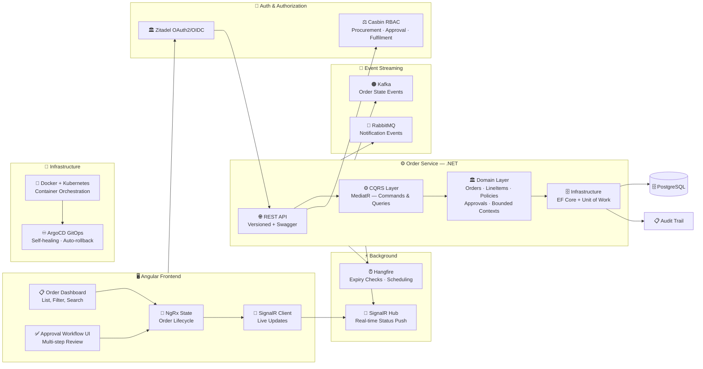

# 📦 GSK Order Management System

### Enterprise Order Orchestration Platform for GlaxoSmithKline

[-8B5CF6?style=flat-square)]()

[← Back to Profile](../GITHUB_PROFILE.md) · [← All Projects](../PROJECTS_INDEX.md)

---

## 📋 TL;DR

> An enterprise-scale **Order Management System** for GSK — orchestrating complex order workflows across procurement, fulfilment, and approval chains at a global pharmaceutical organization. Built on **Kafka event-driven microservices** with DDD, CQRS, Casbin RBAC, and ArgoCD GitOps.

| | |
|---|---|
| **Company** | Sweya AI |
| **Client** | GlaxoSmithKline (GSK) |
| **Role** | Senior Software Engineer → Technical Lead |
| **Period** | Apr 2023 – Jan 2025 |
| **Domain** | Pharmaceutical · Supply Chain · Enterprise Finance |
| **Architecture** | Event-driven Microservices · DDD · CQRS |

---

## 🎯 Core Capabilities

- **Kafka-powered order event pipeline** — decoupled, high-throughput state transitions across bounded contexts
- **Multi-team authorization** — Casbin RBAC scoped per team: procurement, approvers, fulfilment
- **Real-time order tracking** — SignalR WebSocket hub giving stakeholders live visibility into order progression
- **ArgoCD GitOps** — self-healing Kubernetes deployments with automated rollback on failures
- **Full audit trail** — every order action tracked with timestamp, user, and reason

---

## 👨‍💼 My Role

- Designed the **DDD layered architecture** — bounded contexts, aggregate roots, value objects, and domain events
- Implemented the **Kafka event-driven order pipeline** for decoupled, asynchronous state transitions
- Engineered **Casbin RBAC** with role-specific order action authorization across procurement, approval, and fulfilment teams
- Built the **Angular NgRx frontend** with real-time order tracking via SignalR
- Managed **Docker + Kubernetes + ArgoCD** containerized infrastructure and GitOps pipelines

---

## 🏗️ Architecture

---

## 🛠️ Tech Stack

| Layer | Technologies |
|-------|-------------|
| **Frontend** | Angular, NgRx, RxJS, TypeScript |
| **Real-time** | SignalR — live order status streaming |
| **Auth** | Zitadel, OAuth2/OIDC, JWT, Casbin RBAC |
| **Backend** | .NET, ASP.NET Core Web API, MediatR (CQRS) |
| **Architecture** | DDD, Event-Driven, Microservices, Clean Architecture |
| **Event Streaming** | Apache Kafka — order state events |
| **Messaging** | RabbitMQ — notification events |
| **Database** | PostgreSQL, EF Core, Unit of Work, Audit Trail |
| **Background Jobs** | Hangfire — order expiry checks, scheduled reports |
| **Observability** | OpenTelemetry, Serilog |
| **DevOps** | Docker, Kubernetes, ArgoCD GitOps |

---

## 📊 Impact

| Metric | Result |
|--------|--------|
| **Scalability** | Kafka-powered decoupled processing — independently scalable per bounded context |
| **Authorization** | Casbin RBAC scoped precisely per team role |
| **Operational Efficiency** | SignalR eliminated manual status-check overhead |
| **Reliability** | ArgoCD GitOps with automated rollback on deployment failures |

---

## 🏷️ Skills Demonstrated

`.NET` `ASP.NET Core` `C#` `DDD` `CQRS` `MediatR` `Kafka` `RabbitMQ` `SignalR` `Casbin RBAC` `Zitadel` `OAuth2/OIDC` `JWT` `EF Core` `PostgreSQL` `Hangfire` `OpenTelemetry` `Serilog` `Angular` `NgRx` `Docker` `Kubernetes` `ArgoCD`

---

[← Back to Profile](../GITHUB_PROFILE.md) · [📁 All Projects](../PROJECTS_INDEX.md) · [💼 LinkedIn](https://linkedin.com/in/sarkeranik) · [📧 Contact](mailto:ach6266@gmail.com)

