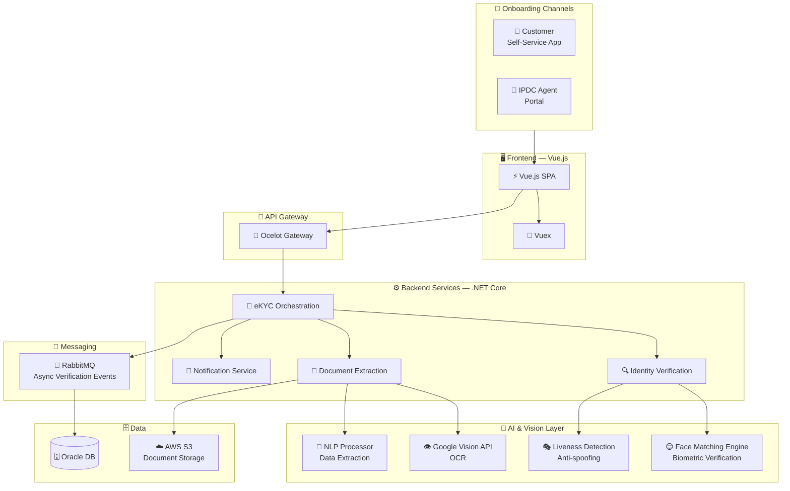

# 🏧 IPDC Finance PLC — eKYC Platform

### AI-Powered Digital Customer Onboarding for Non-Bank Finance

[← Back to Profile](../GITHUB_PROFILE.md) · [← All Projects](../PROJECTS_INDEX.md)

---

## 📋 TL;DR

> A state-of-the-art digital onboarding solution for **IPDC Finance PLC** — one of Bangladesh's leading non-bank financial institutions. Built with Vue.js + .NET Core microservices, integrating **Google Vision AI** for OCR, NLP, biometric face matching, and liveness detection, with secure AWS S3 document storage.

| | |
|---|---|
| **Company** | LEADS Corporation Limited |
| **Client** | IPDC Finance PLC |
| **Role** | Associate Software Engineer |
| **Period** | Jan 2020 – Oct 2021 |
| **Domain** | Non-bank Financial Services · Digital Identity |
| **AI Stack** | Google Vision AI · OCR · NLP · Biometric Matching · Liveness Detection |

---

## 🎯 Key Features

| Feature | Description |
|---------|-------------|
| **Document OCR** | Automatically extracts customer information from NID documents via Google Vision API |
| **AI Image Matching** | Matches live camera capture against NID photo for identity confirmation |
| **NLP Extraction** | Extracts and validates structured data from unstructured document text |
| **Liveness Detection** | Prevents spoofing — verifies live capture is from a real person |
| **Dual Onboarding Mode** | Customer self-service or IPDC agent-assisted flow |
| **Real-time Status Updates** | Applicants and staff receive instant notifications throughout verification |
| **Secure Document Storage** | Captured identity documents stored securely on **AWS S3** |

---

## 🏗️ Architecture

---

## 🛠️ Tech Stack

| Layer | Technologies |
|-------|-------------|
| **Frontend** | Vue.js, Vuex, HTML5, CSS3 |
| **Backend** | .NET Core, ASP.NET Core Web API, EF Core, Dapper |
| **Auth** | JWT, OAuth2 |
| **AI / Vision** | Google Vision API, OCR, NLP, Face Matching, Liveness Detection |
| **API Gateway** | Ocelot — centralized routing and auth enforcement |
| **Messaging** | RabbitMQ — async event-driven verification processing |
| **Database** | Oracle DB |
| **Document Storage** | AWS S3 — secure encrypted storage |
| **Architecture** | Microservices, RESTful APIs |

---

## 📊 Impact

| Metric | Result |
|--------|--------|
| **Onboarding Speed** | Reduced from **several days** to **under 5 minutes** |
| **Manual Bottlenecks** | AI-driven verification eliminated manual document review |
| **Accessibility** | Dual-mode onboarding served tech-savvy and assisted customer segments |
| **Regulatory Compliance** | Aligned with Bangladesh Bank digital KYC requirements |

---

## 🏷️ Skills Demonstrated

`.NET Core` `ASP.NET Core` `Vue.js` `Vuex` `Google Vision API` `OCR` `NLP` `Face Matching` `Liveness Detection` `Ocelot` `RabbitMQ` `Oracle DB` `AWS S3` `JWT` `OAuth2` `Dapper` `Microservices` `eKYC`

---

[← Back to Profile](../GITHUB_PROFILE.md) · [📁 All Projects](../PROJECTS_INDEX.md) · [💼 LinkedIn](https://linkedin.com/in/sarkeranik) · [📧 Contact](mailto:ach6266@gmail.com)

