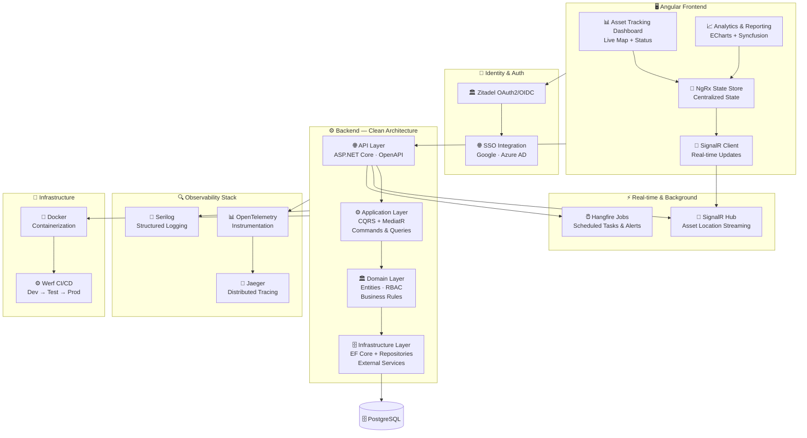

# 🏥 MIRA — Hospital Asset Tracking

### Real-Time Indoor Asset Tracking for Enterprise Healthcare

[← Back to Profile](../GITHUB_PROFILE.md) · [← All Projects](../PROJECTS_INDEX.md)

---

## 📋 TL;DR

> **MIRA** is a production-grade real-time indoor asset tracking platform for hospitals. As **Technical Lead**, I architected the full solution — Clean Architecture .NET 8 backend, modular Angular frontend, OpenTelemetry observability, and a complete DevOps pipeline — reducing manual tracking overhead by **85%**.

| | |
|---|---|
| **Company** | Sweya AI |
| **Role** | Technical Lead (Full-Stack) |
| **Period** | Jan 2025 – Jun 2025 |
| **Domain** | Healthcare · Enterprise Asset Management |
| **Stack Core** | .NET 8 · Angular · SignalR · OpenTelemetry · Docker |
| **Key Result** | 85% reduction in manual asset tracking overhead |

---

## 🎯 Problem → Solution

| ❌ Before | ✅ After MIRA |
|-----------|--------------|
| Manual room-by-room equipment searches | Real-time live location map for every tracked asset |
| No visibility into asset utilization | Dashboard analytics with usage patterns & anomaly detection |
| Hours lost locating critical medical equipment | Instant lookup — seconds to locate any asset |
| No audit trail for equipment movement | Full movement history with timestamp + user attribution |
| No security alerts for unauthorized movement | Real-time RBAC-enforced access + alerts |

---

## 👨‍💼 My Role as Technical Lead

- **Designed the system architecture** from scratch — Clean Architecture layering, API contracts, database schema, DevOps strategy
- **Led full-stack delivery** spanning backend microservices, Angular frontend, and infrastructure
- **Implemented enterprise security** — Zitadel OAuth2/OIDC, multi-tenant RBAC, JWT validation across hospital environments
- **Established observability** — OpenTelemetry distributed tracing, Jaeger, and Serilog structured logging
- **Enforced engineering quality** — Jest + Cypress automated testing, ESLint + Prettier + Husky pre-commit hooks

---

## 🏗️ Architecture

---

## 🛠️ Tech Stack

| Layer | Technologies |
|-------|-------------|
| **Frontend** | Angular, NgRx, RxJS, TypeScript, Angular Material |
| **Data Visualization** | ECharts, Syncfusion Charts |
| **Real-time** | SignalR (WebSockets) — live asset location streaming |
| **Auth / SSO** | Zitadel, OAuth2/OIDC, JWT, Google SSO, Azure AD |
| **Backend** | .NET 8, ASP.NET Core, MediatR (CQRS) |
| **Architecture** | Clean Architecture (4-layer), DDD, Microservices |
| **Database** | PostgreSQL, EF Core, automated migrations |
| **Background Jobs** | Hangfire — alerts, scheduled maintenance, reporting |
| **Observability** | OpenTelemetry, Jaeger, Serilog |
| **Testing** | Jest (Unit), Cypress (E2E) |
| **Code Quality** | ESLint, Prettier, Husky pre-commit hooks |
| **DevOps** | Docker, Werf CI/CD — 3 environments (dev/test/prod) |

---

## 📊 Impact

| Metric | Result |
|--------|--------|
| **Manual Overhead** | **85% reduction** in manual asset tracking overhead |
| **Deployment** | Zero-downtime production deployments with rolling updates |
| **Incident Detection** | Proactive — full distributed tracing via OpenTelemetry + Jaeger |
| **Code Quality** | Jest + Cypress automated testing + strict CI/CD gates |
| **Security** | Multi-tenant hospital environments with isolated RBAC boundaries |

---

## 🏷️ Skills Demonstrated

`.NET 8` `Clean Architecture` `Angular` `NgRx` `SignalR` `ECharts` `Syncfusion` `Zitadel` `OAuth2/OIDC` `JWT` `RBAC` `PostgreSQL` `EF Core` `Hangfire` `OpenTelemetry` `Jaeger` `Serilog` `Docker` `Werf` `Jest` `Cypress` `Technical Leadership`

---

[← Back to Profile](../GITHUB_PROFILE.md) · [📁 All Projects](../PROJECTS_INDEX.md) · [💼 LinkedIn](https://linkedin.com/in/sarkeranik) · [📧 Contact](mailto:ach6266@gmail.com)

