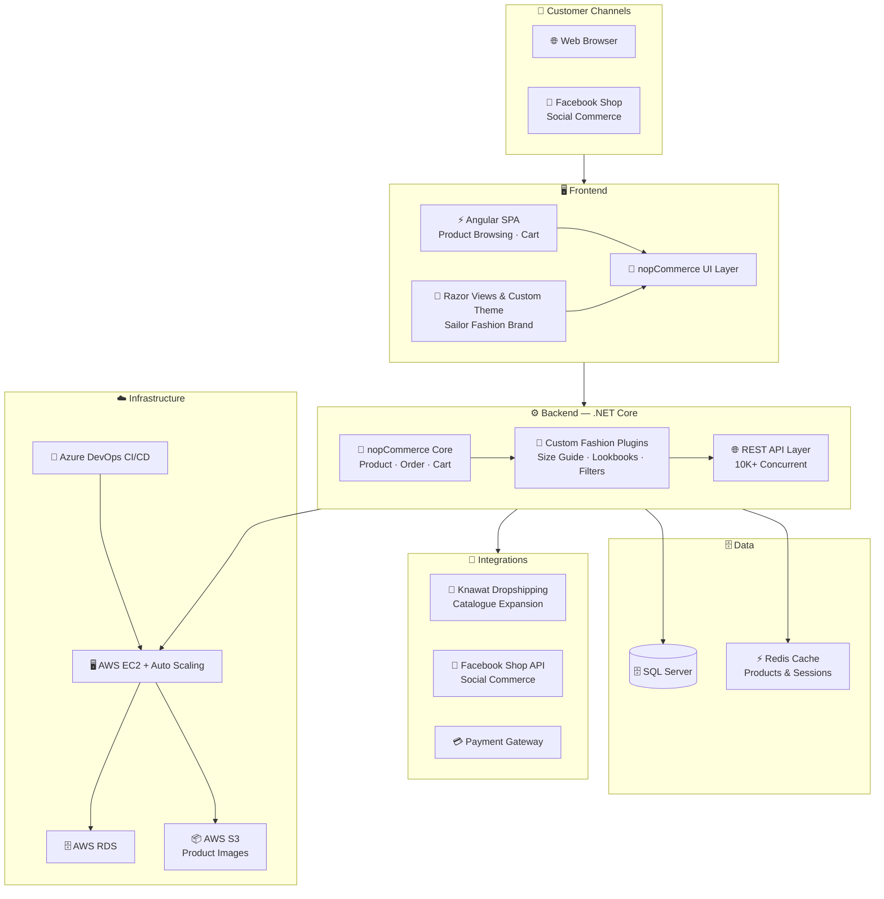

# 👗 Sailor — Fashion & Clothing Store

### Online Fashion Platform with Dropshipping & Social Commerce

[← Back to Profile](../GITHUB_PROFILE.md) · [← All Projects](../PROJECTS_INDEX.md)

---

## 📋 TL;DR

> Comprehensive online clothing store built from scratch on nopCommerce + .NET Core + Angular with Knawat dropshipping integration, Facebook Shop API social commerce, custom fashion plugins (size guides, lookbooks, filters), and AWS Auto Scaling for **10,000+ concurrent users**.

| | |
|---|---|
| **Company** | Brain Station 23 |
| **Client** | Sailor Clothing |
| **Role** | Associate Software Engineer |
| **Period** | Nov 2021 – Jul 2022 |
| **Domain** | Fashion & Clothing E-Commerce |
| **Concurrency** | 10,000+ concurrent users |

---

## 🎯 Key Contributions

- Developed the full **nopCommerce**-based e-commerce platform with custom **Plugins** and **Themes** for the Sailor fashion brand identity
- Built scalable **RESTful APIs** with **.NET Core** engineered to handle up to **10,000 concurrent visitors**
- Integrated **Knawat Dropshipping API** — enabled rapid SKU growth without inventory overhead
- Integrated **Facebook Shop API** — social commerce and catalogue synchronization
- Custom fashion plugins: **size guides**, **lookbooks**, **advanced product filters** — enhanced shopping UX and conversion
- Implemented **Redis caching** to optimize product listing, session, and cart performance
- Leveraged **AWS Auto Scaling** (EC2, RDS, S3) for dynamic traffic handling and reliable media delivery
- Deployed via **Azure DevOps CI/CD** with GitLab-based branching workflows

---

## 🏗️ Architecture

---

## 🛠️ Tech Stack

| Layer | Technologies |
|-------|-------------|
| **E-Commerce Platform** | nopCommerce |
| **Backend** | .NET Core, C#, ASP.NET Core |
| **Frontend** | Angular, TypeScript, HTML5, CSS3, Razor |
| **Database** | Microsoft SQL Server |
| **Caching** | Redis |
| **Third-Party** | Knawat Dropshipping API, Facebook Shop API |
| **Cloud** | AWS (EC2, RDS, S3), Auto Scaling |
| **DevOps** | Azure DevOps, GitLab CI/CD |

---

## 📊 Impact

| Metric | Result |
|--------|--------|
| **Concurrency** | APIs supporting up to **10,000 concurrent users** |
| **Catalogue Scale** | Knawat dropshipping enabled rapid product catalogue expansion |
| **Brand Experience** | Custom fashion plugins (size guides, lookbooks) enhanced conversion |
| **Social Commerce** | Facebook Shop integration opened new sales channel |
| **Reliability** | AWS Auto Scaling maintained performance during traffic spikes |

---

## 🏷️ Skills Demonstrated

`nopCommerce` `.NET Core` `ASP.NET Core` `C#` `Angular` `TypeScript` `SQL Server` `Redis` `Knawat API` `Facebook Shop API` `AWS EC2` `AWS RDS` `AWS S3` `Auto Scaling` `Azure DevOps` `GitLab CI/CD` `REST API`

---

[← Back to Profile](../GITHUB_PROFILE.md) · [📁 All Projects](../PROJECTS_INDEX.md) · [💼 LinkedIn](https://linkedin.com/in/sarkeranik) · [📧 Contact](mailto:ach6266@gmail.com)

