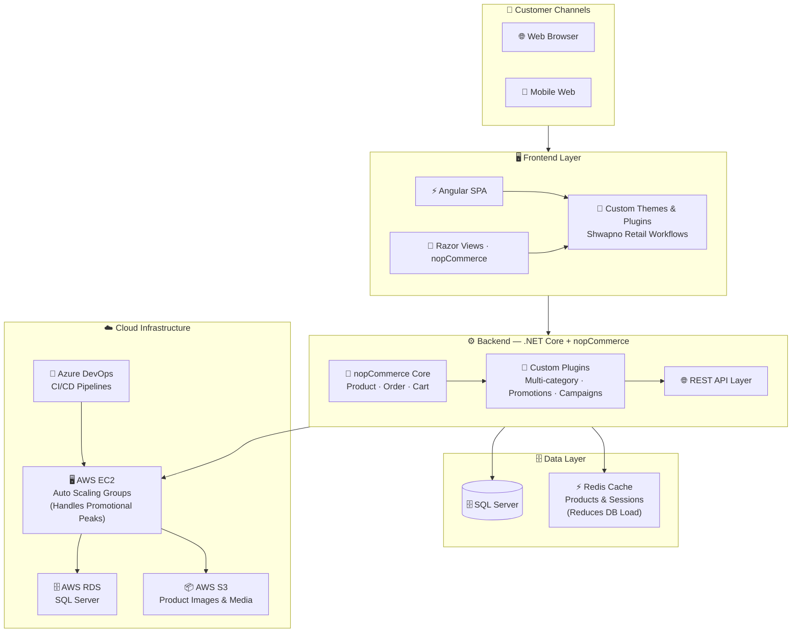

# 🛒 Shwapno — Retail Chain E-Commerce

### National Grocery & Retail Platform · Powered by AWS Auto Scaling

[-F59E0B?style=flat-square)]()

[← Back to Profile](../GITHUB_PROFILE.md) · [← All Projects](../PROJECTS_INDEX.md)

---

## 📋 TL;DR

> Full-featured e-commerce platform for **Shwapno** — one of Bangladesh's largest retail chains (ACI Logistics). Built on nopCommerce + .NET Core + Angular with AWS Auto Scaling and Redis caching to reliably handle **10,000+ concurrent users** during nationwide promotional events.

| | |
|---|---|
| **Company** | Brain Station 23 |
| **Client** | ACI Logistics Ltd. (Shwapno) |
| **Role** | Associate Software Engineer |
| **Period** | Nov 2021 – Jul 2022 |
| **Domain** | Grocery · Retail · FMCG E-Commerce |
| **Concurrency** | 10,000+ concurrent users |

---

## 🎯 Key Contributions

- Developed and deployed custom **nopCommerce Plugins** for Shwapno's unique retail workflows — multi-category product management and promotional campaign support
- Engineered scalable **RESTful APIs** capable of handling **10,000+ concurrent users**
- Implemented **Redis caching** for product listings, session management, and cart data — significantly reducing SQL Server query load
- Configured **AWS Auto Scaling** (EC2, RDS, S3) to dynamically handle traffic surges during promotional events and seasonal peaks
- Managed deployments via **Azure DevOps CI/CD pipelines** with structured GitLab branching
- Contributed custom Plugins and Themes to the **nopCommerce open-source framework**

---

## 🏗️ Architecture

---

## 🛠️ Tech Stack

| Layer | Technologies |
|-------|-------------|
| **E-Commerce Platform** | nopCommerce |
| **Backend** | .NET Core, C#, ASP.NET Core |
| **Frontend** | Angular, TypeScript, HTML5, CSS3, Razor |
| **Database** | Microsoft SQL Server |
| **Caching** | Redis — product listings + session management |
| **Cloud** | AWS (EC2, RDS, S3), Auto Scaling |
| **DevOps** | Azure DevOps, GitLab CI/CD |

---

## 📊 Impact

| Metric | Result |
|--------|--------|
| **Concurrency** | Scaled to **10,000+ concurrent users** across Bangladesh |
| **Performance** | Redis caching improved page load for high-traffic product listings |
| **Marketing Agility** | Campaign plugin enabled self-service promotions without engineering intervention |
| **Reliability** | AWS Auto Scaling maintained performance during traffic spikes |

---

## 🏷️ Skills Demonstrated

`nopCommerce` `.NET Core` `ASP.NET Core` `C#` `Angular` `TypeScript` `SQL Server` `Redis` `AWS EC2` `AWS RDS` `AWS S3` `Auto Scaling` `Azure DevOps` `GitLab CI/CD` `REST API`

---

[← Back to Profile](../GITHUB_PROFILE.md) · [📁 All Projects](../PROJECTS_INDEX.md) · [💼 LinkedIn](https://linkedin.com/in/sarkeranik) · [📧 Contact](mailto:ach6266@gmail.com)

