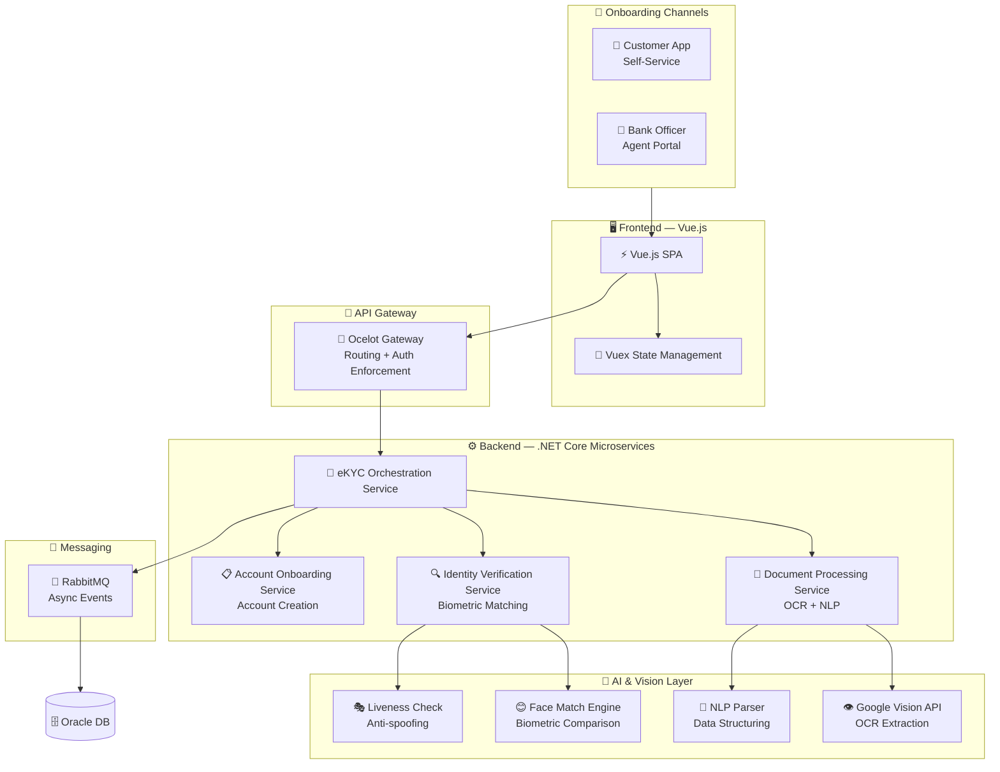

# 🏦 Southeast Bank PLC — eKYC Platform

### AI-Powered Digital KYC with Biometric Face Matching

[← Back to Profile](../GITHUB_PROFILE.md) · [← All Projects](../PROJECTS_INDEX.md)

---

## 📋 TL;DR

> A digital onboarding solution that allows Southeast Bank PLC to onboard new customers **faster, safer, and more cost-effectively**. Built with Vue.js + .NET Core microservices, leveraging AI, OCR, NLP, and biometric verification — fully compliant with Bangladesh Bank's digital KYC guidelines.

| | |
|---|---|
| **Company** | LEADS Corporation Limited |
| **Client** | Southeast Bank PLC |
| **Role** | Associate Software Engineer |
| **Period** | Jan 2020 – Oct 2021 |
| **Domain** | Commercial Banking · Digital Identity |
| **Compliance** | Bangladesh Bank Digital KYC Guidelines |

---

## 🎯 Key Features

- **NID-based Identity Verification** — OCR reads and validates data from national identity documents automatically
- **Biometric Facial Matching** — Live photo matched against NID photo using AI-powered image comparison
- **NLP Data Extraction** — Extracts and structures relevant data points from identity documents
- **Liveness Detection** — Guards against fraudulent spoofing attempts during biometric capture
- **Self-Service & Agent-Assisted Modes** — Flexible onboarding paths for all customer segments
- **Regulatory Compliance** — Designed and validated against Bangladesh Bank's digital KYC guidelines

---

## 🏗️ Architecture

---

## 🛠️ Tech Stack

| Layer | Technologies |
|-------|-------------|
| **Frontend** | Vue.js, Vuex, HTML5, CSS3 |
| **Backend** | .NET Core, ASP.NET Core Web API, EF Core, Dapper |
| **Auth** | JWT, OAuth2 |
| **AI / Vision** | Google Vision API, OCR, NLP, Biometric Matching, Liveness Detection |
| **API Gateway** | Ocelot |
| **Messaging** | RabbitMQ |
| **Database** | Oracle DB |
| **Architecture** | Microservices, RESTful APIs |

---

## 📊 Impact

| Metric | Result |
|--------|--------|
| **Onboarding Speed** | Multi-day in-branch process → **minutes digitally** |
| **Accessibility** | Dual-mode support (self-service + agent) served all customer segments |
| **Compliance** | Validated against Bangladesh Bank digital KYC regulations |
| **Manual Workload** | AI verification pipeline reduced compliance team review load |

---

## 🏷️ Skills Demonstrated

`.NET Core` `ASP.NET Core` `Vue.js` `Vuex` `Google Vision API` `OCR` `NLP` `Biometric Matching` `Liveness Detection` `Ocelot` `RabbitMQ` `Oracle DB` `JWT` `Dapper` `Microservices` `eKYC`

---

[← Back to Profile](../GITHUB_PROFILE.md) · [📁 All Projects](../PROJECTS_INDEX.md) · [💼 LinkedIn](https://linkedin.com/in/sarkeranik) · [📧 Contact](mailto:ach6266@gmail.com)

