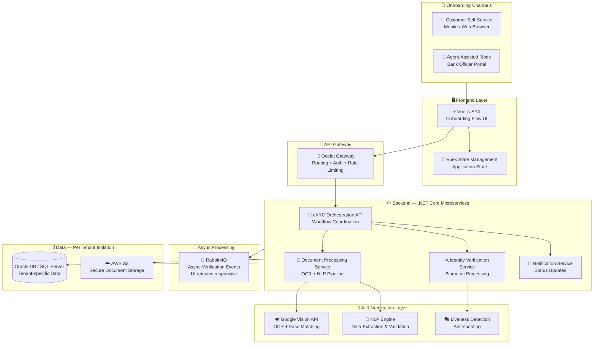

<div align="center">

# 🔐 VerifID — Digital eKYC Platform

### Multi-Tenant AI-Powered Customer Onboarding for Banking

[](https://sweya.ai/verifid)
[](https://sweya.ai/verifid)
[]()
[]()
[]()
[]()

[← Back to Profile](../GITHUB_PROFILE.md) · [← All Projects](../PROJECTS_INDEX.md)

</div>

---

## 📋 TL;DR

> **VerifID** is a multi-tenant AI-powered eKYC SaaS platform serving 3 banking institutions from a single platform instance. It transforms multi-day in-branch onboarding into a **sub-5-minute digital flow** using Google Vision AI, OCR, NLP, and biometric liveness detection.

| | |
|---|---|
| **Company** | Sweya AI |
| **Role** | Technical Lead |
| **Domain** | Banking · FinTech · Digital Identity |
| **Type** | Multi-tenant SaaS |
| **AI Stack** | Google Vision AI · OCR · NLP · Biometric Matching |
| **Impact** | Onboarding: days → under 5 minutes |

---

## 🏦 Banking Clients Powered by VerifID

| Institution | Onboarding Mode | Database | Live |
|-------------|-----------------|---------|------|
| **IPDC Finance PLC** | Self-service + Agent-assisted | Oracle DB | [ipdc.com](https://ipdc.com/) |
| **Southeast Bank PLC** | Self-service + Agent-assisted | Oracle DB | [southeastbank.com.bd](https://www.southeastbank.com.bd/?page=seb_mobile_app) |
| **Dhaka Bank PLC (EZYBANK)** | Simplified & Regular eKYC tiers | SQL Server | [ezybank.dhakabank.com.bd](https://ezybank.dhakabank.com.bd/) |

---

## 🤖 AI Verification Pipeline

```
Customer submits NID document
        ↓
[OCR — Google Vision API]
  → Extracts: Name, DOB, NID Number, Address
        ↓
[NLP Data Extraction]
  → Structures & validates extracted fields
        ↓
[Biometric Face Matching — Google Vision AI]
  → Live camera capture vs. NID photo
        ↓
[Liveness Detection]
  → Prevents: photo spoofing, video attacks, mask attacks
        ↓
[RabbitMQ — Async Processing]
  → Responsive UI while AI processing runs in background
        ↓
✅ Instant account issuance (Simplified) OR review queue (Regular)
```

---

## 🎯 Key Features

| Feature | Description |
|---------|-------------|
| **NID Document Verification** | OCR extracts customer data from national identity documents automatically |
| **AI Face Matching** | Live facial capture matched against NID photo via Google Vision AI |
| **Liveness Detection** | Prevents photo/video spoofing — verifies live person in real-time |
| **NLP Data Extraction** | Extracts and validates structured fields from unstructured document text |
| **Dual Onboarding Modes** | Self-service (customer-initiated) or agent-assisted (bank officer guided) |
| **Instant Account Issuance** | Simplified eKYC tier — account number issued immediately on verification |
| **Multi-tenant Architecture** | 3 banks served from one platform — isolated data, configurable workflows |
| **Regulatory Compliance** | Fully aligned to Bangladesh Bank digital KYC guidelines |

---

## 🏗️ Architecture



---

## 🛠️ Tech Stack

| Layer | Technologies |
|-------|-------------|
| **Frontend** | Vue.js, Vuex, HTML5, CSS3 |
| **Backend** | .NET Core 3.1, ASP.NET Core Web API, EF Core, Dapper |
| **Auth** | JWT, OAuth2 |
| **AI / Vision** | Google Vision API, OCR, NLP, Biometric Matching, Liveness Detection |
| **API Gateway** | Ocelot — routing, auth, rate limiting |
| **Messaging** | RabbitMQ — async verification event processing |
| **Database** | Oracle DB (IPDC, Southeast), SQL Server (Dhaka Bank) |
| **Storage** | AWS S3 — secure document storage |
| **Architecture** | Microservices, RESTful APIs, Multi-tenant SaaS |

---

## 📊 Impact

| Metric | Result |
|--------|--------|
| **Onboarding Speed** | Reduced from **days (in-branch)** to **under 5 minutes (digital)** |
| **Document Accuracy** | AI-powered OCR eliminated manual data entry errors entirely |
| **Regulatory Compliance** | Fully aligned to Bangladesh Bank's digital KYC guidelines |
| **Scale** | Deployed across **3 banking institutions** from a single multi-tenant platform |
| **Fraud Prevention** | Liveness detection + biometric matching blocked spoofing attempts at enrollment |

---

## 🏷️ Skills Demonstrated

`.NET Core` `ASP.NET Core` `Vue.js` `Vuex` `Google Vision API` `OCR` `NLP` `Biometric Matching` `Liveness Detection` `Ocelot API Gateway` `RabbitMQ` `Oracle DB` `SQL Server` `JWT` `OAuth2` `AWS S3` `Microservices` `Multi-tenant Architecture`

---

<div align="center">

[← Back to Profile](../GITHUB_PROFILE.md) · [📁 All Projects](../PROJECTS_INDEX.md) · [💼 LinkedIn](https://linkedin.com/in/sarkeranik) · [📧 Contact](mailto:ach6266@gmail.com)

</div>
